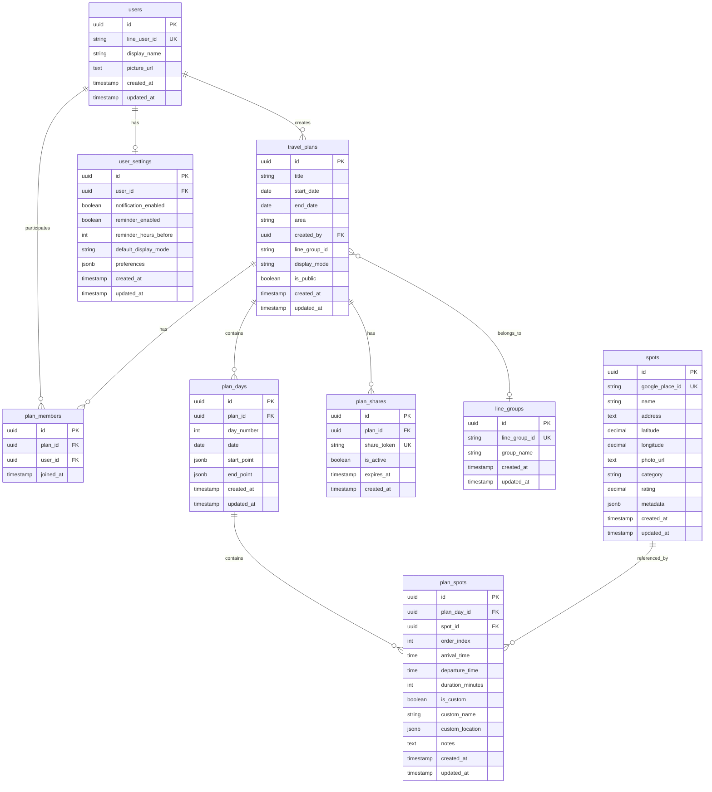
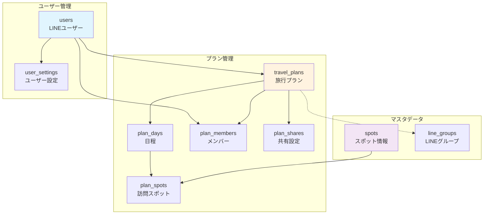

# DBスキーマ設計書

## 概要
本ドキュメントは、tabijiアプリケーションのデータベーススキーマ設計を定義します。
各テーブルは機能要件と密接に連携し、効率的なデータ管理を実現します。

### 設計方針
- シンプルさを重視し、必要最小限の構造で実装
- 友達同士の少人数グループでの利用を想定
- 全メンバーが平等に編集できる権限設計（roleベースの権限管理は不採用）
- プラン削除のみ作成者に限定

## ER図

## 簡略版ER図（関係性に焦点）

## テーブル詳細

### 1. users（ユーザー）
**機能**: LINE認証によるユーザー管理、プラン作成者の識別

| カラム名 | 型 | 制約 | 説明 |
|---------|-----|------|------|
| id | UUID | PRIMARY KEY | ユーザーID |
| line_user_id | VARCHAR(50) | UNIQUE, NOT NULL | LINE ユーザーID |
| display_name | VARCHAR(100) | | LINE表示名 |
| picture_url | TEXT | | プロフィール画像URL |
| created_at | TIMESTAMP | NOT NULL | 作成日時 |
| updated_at | TIMESTAMP | NOT NULL | 更新日時 |

**インデックス**:
- `idx_users_line_user_id` ON (line_user_id)

---

### 2. travel_plans（旅行プラン）
**機能**: 旅行プランの基本情報管理、日程管理

| カラム名 | 型 | 制約 | 説明 |
|---------|-----|------|------|
| id | UUID | PRIMARY KEY | プランID |
| title | VARCHAR(100) | NOT NULL | プランタイトル |
| start_date | DATE | NOT NULL | 開始日 |
| end_date | DATE | NOT NULL | 終了日 |
| area | VARCHAR(50) | | エリア（例：東京、関西） |
| created_by | UUID | FOREIGN KEY | 作成者ID (users.id) |
| line_group_id | VARCHAR(50) | | LINEグループID |
| display_mode | VARCHAR(20) | DEFAULT 'order_only' | 表示モード（order_only/with_time） |
| is_public | BOOLEAN | DEFAULT FALSE | 公開フラグ |
| created_at | TIMESTAMP | NOT NULL | 作成日時 |
| updated_at | TIMESTAMP | NOT NULL | 更新日時 |

**インデックス**:
- `idx_plans_created_by` ON (created_by)
- `idx_plans_line_group_id` ON (line_group_id)
- `idx_plans_start_date` ON (start_date)

---

### 3. plan_days（プラン日程）
**機能**: 日別の旅程管理、各日のスタート/ゴール地点設定

| カラム名 | 型 | 制約 | 説明 |
|---------|-----|------|------|
| id | UUID | PRIMARY KEY | 日程ID |
| plan_id | UUID | FOREIGN KEY | プランID (travel_plans.id) |
| day_number | INTEGER | NOT NULL | 何日目か（1, 2, 3...） |
| date | DATE | NOT NULL | 該当日付 |
| start_point | JSONB | | 開始地点（名称、座標等） |
| end_point | JSONB | | 終了地点（名称、座標等） |
| created_at | TIMESTAMP | NOT NULL | 作成日時 |
| updated_at | TIMESTAMP | NOT NULL | 更新日時 |

**制約**:
- UNIQUE(plan_id, day_number)
- UNIQUE(plan_id, date)

---

### 4. spots（スポットマスタ）
**機能**: Google Maps APIから取得したスポット情報のキャッシュ

| カラム名 | 型 | 制約 | 説明 |
|---------|-----|------|------|
| id | UUID | PRIMARY KEY | スポットID |
| google_place_id | VARCHAR(100) | UNIQUE | Google Place ID |
| name | VARCHAR(200) | NOT NULL | スポット名 |
| address | TEXT | | 住所 |
| latitude | DECIMAL(10,8) | NOT NULL | 緯度 |
| longitude | DECIMAL(11,8) | NOT NULL | 経度 |
| photo_url | TEXT | | 写真URL |
| category | VARCHAR(50) | | カテゴリ |
| rating | DECIMAL(2,1) | | 評価 |
| metadata | JSONB | | その他のメタデータ |
| created_at | TIMESTAMP | NOT NULL | 作成日時 |
| updated_at | TIMESTAMP | NOT NULL | 更新日時 |

**インデックス**:
- `idx_spots_google_place_id` ON (google_place_id)
- `idx_spots_location` ON (latitude, longitude)

---

### 5. plan_spots（プランスポット）
**機能**: 各プランでの訪問スポット管理、訪問順序と時刻の管理

| カラム名 | 型 | 制約 | 説明 |
|---------|-----|------|------|
| id | UUID | PRIMARY KEY | プランスポットID |
| plan_day_id | UUID | FOREIGN KEY | 日程ID (plan_days.id) |
| spot_id | UUID | FOREIGN KEY | スポットID (spots.id) - NULL可 |
| order_index | INTEGER | NOT NULL | 訪問順序 |
| arrival_time | TIME | | 到着予定時刻 |
| departure_time | TIME | | 出発予定時刻 |
| duration_minutes | INTEGER | | 滞在時間（分） |
| is_custom | BOOLEAN | DEFAULT FALSE | ユーザー手動入力フラグ |
| custom_name | VARCHAR(200) | | カスタムスポット名 |
| custom_location | JSONB | | カスタム位置情報 |
| notes | TEXT | | メモ |
| created_at | TIMESTAMP | NOT NULL | 作成日時 |
| updated_at | TIMESTAMP | NOT NULL | 更新日時 |

**制約**:
- UNIQUE(plan_day_id, order_index)
- CHECK(spot_id IS NOT NULL OR is_custom = TRUE)

---

### 6. plan_members（プランメンバー）
**機能**: 複数人でのプラン共有、プラン参加者の管理

| カラム名 | 型 | 制約 | 説明 |
|---------|-----|------|------|
| id | UUID | PRIMARY KEY | メンバーID |
| plan_id | UUID | FOREIGN KEY | プランID (travel_plans.id) |
| user_id | UUID | FOREIGN KEY | ユーザーID (users.id) |
| joined_at | TIMESTAMP | NOT NULL | 参加日時 |

**制約**:
- UNIQUE(plan_id, user_id)

**設計のポイント**:
- 全メンバーが同等の編集権限を持つ
- プラン削除のみ作成者（travel_plans.created_by）に限定

---

### 7. line_groups（LINEグループ）
**機能**: LINEグループ情報の管理

| カラム名 | 型 | 制約 | 説明 |
|---------|-----|------|------|
| id | UUID | PRIMARY KEY | グループID |
| line_group_id | VARCHAR(50) | UNIQUE, NOT NULL | LINEグループID |
| group_name | VARCHAR(100) | | グループ名 |
| created_at | TIMESTAMP | NOT NULL | 作成日時 |
| updated_at | TIMESTAMP | NOT NULL | 更新日時 |

---

### 8. user_settings（ユーザー設定）
**機能**: 通知設定、デフォルト設定の管理

| カラム名 | 型 | 制約 | 説明 |
|---------|-----|------|------|
| id | UUID | PRIMARY KEY | 設定ID |
| user_id | UUID | FOREIGN KEY UNIQUE | ユーザーID (users.id) |
| notification_enabled | BOOLEAN | DEFAULT TRUE | 通知有効フラグ |
| reminder_enabled | BOOLEAN | DEFAULT FALSE | リマインダー有効フラグ |
| reminder_hours_before | INTEGER | DEFAULT 24 | リマインダー時間（何時間前） |
| default_display_mode | VARCHAR(20) | DEFAULT 'order_only' | デフォルト表示モード |
| preferences | JSONB | | その他の設定 |
| created_at | TIMESTAMP | NOT NULL | 作成日時 |
| updated_at | TIMESTAMP | NOT NULL | 更新日時 |

---

### 9. plan_shares（プラン共有設定）
**機能**: プランの外部共有、共有リンク管理

| カラム名 | 型 | 制約 | 説明 |
|---------|-----|------|------|
| id | UUID | PRIMARY KEY | 共有ID |
| plan_id | UUID | FOREIGN KEY | プランID (travel_plans.id) |
| share_token | VARCHAR(100) | UNIQUE, NOT NULL | 共有トークン |
| is_active | BOOLEAN | DEFAULT TRUE | 有効フラグ |
| expires_at | TIMESTAMP | | 有効期限 |
| created_at | TIMESTAMP | NOT NULL | 作成日時 |

**インデックス**:
- `idx_shares_token` ON (share_token)

---

## 機能とテーブルのマッピング

### MVP機能
| 機能 | 関連テーブル | 説明 |
|------|-------------|------|
| 旅行プラン作成 | travel_plans, plan_days | プラン基本情報と日程の作成 |
| 日程入力（カレンダーUI） | travel_plans | 開始日・終了日の設定 |
| エリア選択 | travel_plans | エリア情報の保存 |
| スポット選択 | spots, plan_spots | Google Maps APIからのスポット取得と選択 |
| 地図表示 | plan_spots, spots | 選択スポットの地図上への表示 |
| 旅程自動生成 | plan_days, plan_spots | 最適な訪問順序の計算と保存 |
| プラン保存 | 全テーブル | データの永続化 |
| LINE Bot連携 | users, line_groups | LINEユーザーとグループの管理 |
| 保存済みプラン一覧 | travel_plans, plan_members | ユーザーが作成・参加したプランの表示 |

### 将来機能
| 機能 | 関連テーブル | 説明 |
|------|-------------|------|
| スタート/ゴール地点設定 | plan_days | start_point, end_pointカラムで管理 |
| 移動時間詳細 | plan_spots | arrival_time, departure_timeで管理 |
| リマインダー通知 | user_settings | 通知設定の管理 |
| 複数人編集 | plan_members | 全メンバーが同等の編集権限 |
| プラン共有 | plan_shares | 共有リンクの生成と管理 |

## インデックス戦略

1. **検索性能の最適化**
   - LINE IDによるユーザー検索
   - 日付範囲でのプラン検索
   - Google Place IDによるスポット検索

2. **結合性能の向上**
   - 外部キーへのインデックス追加
   - 頻繁に結合されるカラムへのインデックス

3. **ユニーク制約**
   - LINE IDの一意性保証
   - プラン内での訪問順序の一意性

## パフォーマンス考慮事項

1. **JSONBカラムの活用**
   - 柔軟な構造データの保存（メタデータ、設定等）
   - 将来の拡張に対応

2. **適切なデータ型の選択**
   - 座標情報にDECIMAL型を使用
   - LINE IDには固定長VARCHAR

3. **正規化レベル**
   - 第3正規形を基本とし、パフォーマンス要件に応じて非正規化も検討

## セキュリティ考慮事項

1. **Row Level Security (RLS)**
   - Supabaseの機能を活用し、ユーザーごとのアクセス制御

2. **個人情報の保護**
   - LINE IDや個人設定の適切な管理
   - 共有トークンの安全な生成と管理

## 今後の拡張性

1. **バージョニング対応**
   - プラン編集履歴の保存（将来的にhistoryテーブル追加）

2. **分析機能**
   - 人気スポットの集計
   - ユーザー行動分析

3. **外部連携**
   - 他のSNSとの連携
   - 外部カレンダーアプリとの同期